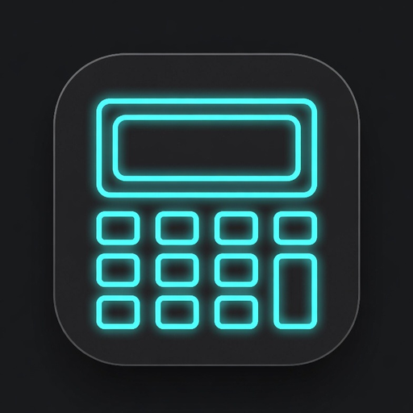

# 💎 Premium Business Calculator (高階商務計算機)

### 超越原生 App 的極客美學！用 Antigravity IDE + Gemini 打造 120FPS 液態玻璃商務引擎

---

## 📖 專案緣起 (Project Vision)

本專案為參加 **Build on Google AI 鐵人賽** 的旗艦參賽作品。

傳統 Web 計算機往往充斥著廉價「網頁感」、IEEE 754 浮點數尾數誤差、缺乏物理手感與離線斷網卡死等痛點。

**「Premium Business Calculator」** 旨在證明：透過 **Google Antigravity IDE** 與 **Gemini Pro** 的架構重構賦能，Web 應用不僅能擁有具備 120FPS 滿幀的 Apple 液態玻璃 (Liquid Glass) 光學質感，更能擁有精準無誤的金融級運算心臟與突破平台限制的聲學觸覺反饋！

---

## 🚀 線上體驗 (Live Demo)

- 🌐 **線上體驗網址**：https://410355-collab.github.io/Premium-Business-Calculator/
- 📱 **強烈推薦**：使用 iPhone (Safari) 或 Android (Chrome) 開啟，並點擊「加入主畫面 (PWA)」，體驗零延遲全螢幕操作與實體敲擊感！

---

## 🌟 核心黑科技與架構亮點

### 1. 🧊 液態玻璃光學渲染 (Apple Liquid Glass & 120FPS GPU)
- **0.5px 髮絲紋高光**：在 Retina 螢幕精準映射 1 物理像素，搭配多重內嵌投影 (`box-shadow: inset`)，實現零效能負擔的透光晶體厚度。
- **單通道毛玻璃合成架構**：徹底剔除多層模糊 Shader 負載，全域圖層隔離 (`will-change: transform`, `translate3d`)，實測達成 **0 次 Layout Shift (CLS)**。

### 2. 🔊 Web Audio 聲學微脈衝觸覺回饋 (Acoustic Haptics)
- **突破 iOS Safari 限制**：針對蘋果封殺 Vibration API 的長年痛點，利用 Web Audio API 合成 **14ms 超短低頻正弦波 (130Hz→30Hz)**，運用大腦感官聯覺模擬實體微動開關的敲擊阻尼感。
- **生理級錯誤警示**：計算語法異常時發射 **80ms 雙鋸齒波 (160Hz→50Hz)**，提供直覺的無障礙體感反饋。

### 3. 🧩 自訂鍵盤佈局與空間演算法 (Custom Layout System)
- **順延推擠挪位 (Push & Reflow)**：拖曳調換按鍵順序時，目標位置按鍵平滑讓位，搭配 100% 視口座標貼合之發光槽位指示器。
- **Hysteresis 遲滯防抖演算法**：指針需具備 >15% 空間優勢才跳格，消除邊界微移閃爍。
- **Touch Lift 視線微抬升**：觸控操作自動向上抬升 22px，防止大拇指遮擋落點。
- **四大網格秒速切換**：支援 4×6 (科學進階)、4×5 (全能商務)、4×4 (極簡核心)、3×4 (大數字) 與平滑形變動畫。

### 4. 🧮 金融級高精度運算與 Casio 商務邏輯
- **64 位元 BigNumber 運算**：徹底消除 `0.1 + 0.2 = 0.30000000000000004` 的 IEEE 754 浮點數誤差。
- **Casio 雙軌百分比解構**：完美還原加價 (`100 + 5% = 105`)、折扣 (`100 - 5% = 95`) 與 Mark-up 毛利運算 (`100 ÷ 5% = 2000`)。
- **TAX+ / TAX- 雙向稅率核心**：含稅/未稅一鍵切換與長按 Casio SET 模式極速設定各國稅率。

### 5. 💱 全球即時匯率中心與 Local Mode
- **自動時區與地理識別**：自動偵測所在國家，當來源與目標幣別相同時自動啟動「本地模式」收合膠囊。
- **離線韌性與琥珀色預警**：支援 LocalStorage 離線快照推算；資料超過 24 小時未聯網更新時點亮琥珀色 `(>24h)` 警示標記。

### 6. 📊 智慧記帳氣泡與 Excel (.xlsx) 匯出
- **即時記帳分類氣泡**：計算完成自動淡入 6 大標籤（🍜食、👕衣、🏠住、🚗行、💼商務、🏷️一般），單手極速記帳。
- **正規 Excel 導出**：整合離線 SheetJS 引擎，一鍵匯出標準 `.xlsx` 檔案，支援樞紐分析與行動端 Web Share API。

---

## 🛠️ 技術棧 (Tech Stack)
- **Core**：Vanilla JavaScript (ES6+), HTML5, Vanilla CSS3 (Zero Dependencies)
- **Math Engine**：`math.js` (BigNumber 64-bit precision)
- **Spreadsheet Engine**：`SheetJS (xlsx.full.min.js)`
- **Audio Synthesis**：Web Audio API (OscillatorNode, GainNode)
- **PWA & Offline**：Service Worker (Network First for navigation + Cache First for assets)
- **AI Toolchain**：Google Antigravity IDE + Gemini Pro

---

## 📝 30 天鐵人賽文章連載專欄
本專案完整開發過程記錄於 **Build on Google AI 鐵人賽** 30 天技術專欄：
- [Day 1：超越原生 App 的極客美學！用 Antigravity IDE+ Gemini 打造 120FPS 液態玻璃商務引擎](https://ithelp.ithome.com.tw/)
- [Day 2：0.5px 髮絲紋與單通道毛玻璃—液態玻璃 (Liquid Glass) CSS/SVG 渲染](https://ithelp.ithome.com.tw/)
- [Day 3：突破 iOS Safari 限制！用 Web Audio API 打造 14ms 聲學微脈衝擬真觸覺回饋](https://ithelp.ithome.com.tw/)
- *(更多章節每日持續連載中...)*

---

## 📄 開源授權 (License)
本專案採用 [MIT License](LICENSE) 授權開源。
