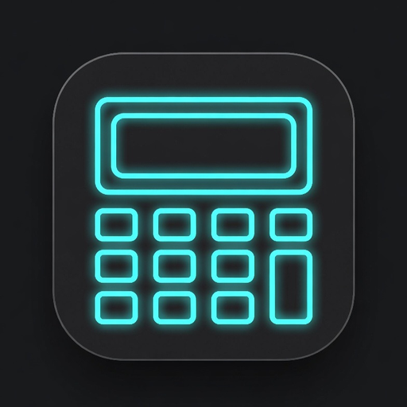

# 💎 Premium Business Calculator (高階商務計算機)

### 超越原生 App 的極客美學！用 Antigravity IDE + Gemini 打造 120FPS 液態玻璃商務引擎與智慧 AI 記帳系統

---

## 📖 專案緣起 (Project Vision)

本專案為參加 **Build on Google AI 鐵人賽** 的旗艦參賽作品。

傳統 Web 計算機往往充斥著廉價「網頁感」、IEEE 754 浮點數尾數誤差、缺乏物理手感、離線斷網卡死，以及繁瑣的人工記帳痛點。

**「Premium Business Calculator」** 旨在證明：透過 **Google Antigravity IDE** 與 **Gemini** 的多模態 AI 架構賦能，Web 應用不僅能擁有 120FPS 滿幀的 Apple 液態玻璃 (Liquid Glass) 光學質感與突破平台限制的聲學微脈衝觸覺反饋，更整合了**相機/發票 OCR 辨識**、**台灣電子發票地端雙 QR Code 免 Key 極速解析**、**多國幣別自動定位**、**跨裝置 Firebase 雲端雙向同步**，打造出金融級的商務運算與智慧旅行記帳旗艦引擎！

---

## 🚀 線上體驗 (Live Demo)

- 🌐 **線上體驗網址**：https://410355-collab.github.io/Premium-Business-Calculator/
- 📱 **強烈推薦**：使用 iPhone (Safari) 或 Android (Chrome) 開啟，並點擊「加入主畫面 (PWA)」，體驗零延遲全螢幕操作、獨立視窗與實體擬真敲擊手感！

---

## 🌟 核心黑科技與架構亮點

### 1. 📷 多模態 AI 發票/收據掃描記帳與地端 QR Code 雙重加速 (AI Invoice & Receipt Scan)
- **台灣電子發票地端雙 QR Code 免 Key 0 秒速解**：
  地端導入多重路徑影像演算法 (`detectQRCodeMultiPass`)，包含發票下半部 200% 特化區域放大與高對比二值化處理，免連網即可瞬時解析明細；同時於 Gemini 視覺 Prompt 設定最高優先權指令。
- **Gemini 視覺模型辨識與自動容錯**：
  採用官方自動負載平衡端點，優先呼叫超輕量極速模型 `gemini-flash-lite-latest`（秒級辨識、高效率），並以 `gemini-flash-latest` 為備援；自動辨識商品品名、數量、金額，智慧過濾通用贅字，並強制解析精準交易時間（`YYYY-MM-DD HH:mm:ss`）與民國年自動轉西元年。
- **酷炫霓虹雷射掃描動畫**：
  拍照、選擇圖片或剪貼簿 `Ctrl+V` 貼上後，動態觸發極客霓虹雷射光束掃描線、脈動網格與四角對焦框動畫。
- **明細整張歸檔 vs 拆分單一商品雙模式**：
  支援將一張發票收納為 1 筆卡片總額（內建 Accordion 手風琴展開細項），亦可選擇一鍵拆分匯入，徹底解決多商品刷屏問題。
- **AI 智慧店家與消費情境判斷**：
  自動依店家與商品性質歸類：現場/即時餐飲（餐廳、小吃、咖啡廳）精準歸類「食」；藥妝店、免稅店、百貨公司等商品歸類「購物」。

### 2. 🌍 GPS/IP 地理位置感應與旅行多幣別換算 (Multi-Currency & Travel Report)
- **高速地理定位與多國貨幣支援**：
  高速 IP 定位優先搭配後備 GPS 機制，開啟掃描時自動感應所在國家（支援台灣 TWD、美金 USD、日圓 JPY、歐元 EUR、人民幣 CNY、英鎊 GBP、韓元 KRW、港幣 HKD、越南盾 VND、泰銖 THB 等 10 大貨幣）。
- **即時折算與旅行支出動態分析**：
  外幣消費自動依當日即時匯率換算至 TWD；匯出的 Excel 表格右側內建動態分析區塊，使用整欄參照公式 (`=SUMIF`)，下載即可一鍵插入 Excel 圓餅圖，新增記帳列自動連動。

### 3. 🧊 液態玻璃光學渲染 (Apple Liquid Glass & 120FPS GPU)
- **0.5px 髮絲紋高光**：在 Retina 螢幕精準映射 1 物理像素，搭配多重內嵌投影 (`box-shadow: inset`)，實現零效能負擔的透光晶體厚度。
- **單通道毛玻璃合成架構**：徹底剔除多層模糊 Shader 負載，全域圖層隔離 (`will-change: transform`, `translate3d`)，實測達成 **0 次 Layout Shift (CLS)**。
- **高透光中央彈跳對話框**：居中彈窗 Modal (`.alert-overlay` + `.history-action-card`)，採用深邃 35px 高斯模糊與低濃度背景遮罩，讓底層按鍵與光影柔和自然透出。
- **下拉選單與頂層 Toast 隔離**：下拉選單套用玻璃折射遮罩，通知氣泡置於頂層 z-index 隔離，選單開啟時自動隱藏背景干擾。

### 4. 🔊 Web Audio 聲學微脈衝觸覺回饋 (Acoustic Haptics)
- **突破 iOS Safari 限制**：針對蘋果封殺 Vibration API 的長年痛點，利用 Web Audio API 合成 **14ms 超短低頻正弦波 (130Hz→30Hz)**，運用大腦感官聯覺模擬實體微動開關的敲擊阻尼感。
- **生理級錯誤警示**：計算語法異常時發射 **80ms 雙鋸齒波 (160Hz→50Hz)**，提供直覺的無障礙體感反饋。

### 5. 🧩 仿手機首頁 App 拖曳自訂鍵盤佈局 (Custom Layout System)
- **順延推擠挪位 (Push & Reflow)**：手指長按拖曳按鍵跨越邊界時，周圍按鍵平滑讓位，搭配 100% 絕對視口貼合的發光槽位指示器。
- **智慧空白格區域吸收 (Smart Blank Absorption)**：從按鍵庫拖入新鍵時，自動定位最近空白格（⬚）並平滑挪移填補，現有按鍵完全不被擠出版面。
- **iOS Jiggle 抖動模式與長按直達**：主介面長按任一按鍵 550ms 觸發強烈震動，直接呼叫鍵盤自訂選單並進入 4 軌非同步擺動 (Jiggle) 編輯動態。
- **Hysteresis 遲滯防抖演算法**：指針需具備 >15% 空間優勢才跳格，消除邊界微幅抖動。
- **六大網格與直橫向獨立配置**：支援 6×4、5×4、4×6、4×5、4×4、3×4 網格切換與形變動畫；直向、橫向、多螢幕分割畫面 (Mode C) 獨立持久化儲存。
- **高達 40 步 Undo/Redo 與佈局快照**：完整支援 40 步歷史堆疊復原與重做；內建「商務」、「旅遊」、「工程」三大佈局快照一鍵切換與個人方案持久化。

### 6. 🧮 金融級高精度運算與 Casio 商務邏輯
- **64 位元 BigNumber 運算**：使用 math.js 與 Epsilon 尾數噪點過濾，徹底消除 `0.1 + 0.2 = 0.30000000000000004` 等浮點數誤差。
- **Casio 雙軌百分比解構**：完美還原加價 (`100 + 5% = 105`)、折扣 (`100 - 5% = 95`)、求值 (`100 × 5% = 5`) 與 Mark-up 毛利運算 (`100 ÷ 5% = 2000`)。
- **TAX+ / TAX- 雙向稅率核心**：含稅/未稅一鍵切換，長按直達 Casio SET 模式極速設定各國稅率。
- **算式游標局部點擊與高頻連續刪除**：點擊算式任意位置精準定位閃爍游標，支援局部插入/刪除；長按「⌫ (Backspace)」360ms 後自動開啟高頻連續刪除模式（每 65ms 刪除一格）。
- **iOS 多位數自適應縮放**：數值超出邊界時動態自適應縮放，達到縮放極限無縫開啟 iOS 級橫向觸控滾動數字列。
- **發光 [M] 記憶體指示燈**：記憶體數值非零時即時點亮呼吸光暈，點擊快速呼叫 (MR)。
- **大數字雙模切換**：支援完整千分位「直接顯示 (DIRECT)」與緊湊型「科學記號 (SCI)」自由切換。

### 7. ☁️ Google 帳號登入與 Firebase 雲端雙向同步 (Cloud Sync)
- **Local-First 本機優先架構**：離線下所有資料存於 LocalStorage 與 IndexedDB 雙重備援，秒開無延遲。
- **Firebase 自動背景同調**：整合 Google Auth 登入，即時將計算歷史、自訂鍵盤佈局、快照設定雙向同步至 Cloud Firestore，無縫跨裝置切換。
- **PWA Network-First 與版本自動更新**：Service Worker 實施 Network-First 策略，偵測到新版本自動彈出動態島級「發現新版本」提示條，點擊即時無縫重新載入。

### 8. 📊 雙模式歷史紀錄與正規 Excel (.xlsx) 匯出
- **雙模式獨立分頁**：
  - **🧾 記帳紀錄**：獨立管理日常與旅遊記帳，頂部動態統計今日累計支出，支援直接匯出 Excel。
  - **💼 商務紀錄**：獨立收納純數值計算與商務運算，自動與記帳明細分離，保持版面清爽。
- **即時記帳分類微氣泡**：按下等於鍵自動浮現 6 大分類微氣泡膠囊，單手極速完成記帳歸類。
- **正規 Excel 導出**：整合離線 SheetJS 引擎，一鍵匯出標準 `.xlsx` 試算表（含消費明細與右側 `=SUMIF` 統計區塊），支援行動端 Web Share API 原生分享。

---

## 🛠️ 技術棧 (Tech Stack)

| 領域 | 技術與方案 |
| :--- | :--- |
| **Core Architecture** | Vanilla JavaScript (ES6+), HTML5, Vanilla CSS3 (Zero Heavy Frameworks) |
| **AI / Multi-Modal** | Google Gemini API (`gemini-flash-lite-latest` / `gemini-flash-latest`) |
| **Computer Vision / OCR** | 地端電子發票雙 QR Code Multi-Pass 影像解析 + Canvas 智慧壓縮 |
| **Math Engine** | `math.js` (BigNumber 64-bit precision) + Epsilon Filtering |
| **Spreadsheet Engine** | `SheetJS (xlsx.full.min.js)` |
| **Cloud & Auth** | Google Firebase (Authentication & Cloud Firestore) |
| **Audio Synthesis** | Web Audio API (OscillatorNode, GainNode 聲學擬真微脈衝) |
| **PWA & Offline** | Service Worker (Network First 導航 + Cache First 靜態資源) + IndexedDB |
| **AI Toolchain** | Google Antigravity IDE + Gemini Pro |

---

## 📝 30 天鐵人賽文章連載專欄

本專案完整開發與架構演進過程記錄於 **Build on Google AI 鐵人賽** 30 天技術專欄：
- [Day 1：超越原生 App 的極客美學！用 Antigravity IDE + Gemini 打造 120FPS 液態玻璃商務引擎](https://ithelp.ithome.com.tw/)
- [Day 2：0.5px 髮絲紋與單通道毛玻璃—液態玻璃 (Liquid Glass) CSS/SVG 渲染](https://ithelp.ithome.com.tw/)
- [Day 3：突破 iOS Safari 限制！用 Web Audio API 打造 14ms 聲學微脈衝擬真觸覺回饋](https://ithelp.ithome.com.tw/)
- [Day 4：精準金融級運算—消除 IEEE 754 誤差與 Casio 百分比邏輯還原](https://ithelp.ithome.com.tw/)
- [Day 5：仿手機首頁拖曳物理—順延推擠 (Push & Reflow) 與 Hysteresis 遲滯演算法](https://ithelp.ithome.com.tw/)
- [Day 6：多模態 AI 賦能！Gemini Flash Lite 極速發票辨識與地端雙 QR Code 免 Key 0 秒速解](https://ithelp.ithome.com.tw/)
- [Day 7：跨裝置無縫漫遊—Google Auth 與 Firebase Local-First 雲端同步架構](https://ithelp.ithome.com.tw/)
- *(更多章節每日持續連載中...)*

---

## 📄 開源授權 (License)

本專案採用 [MIT License](LICENSE) 授權開源。
